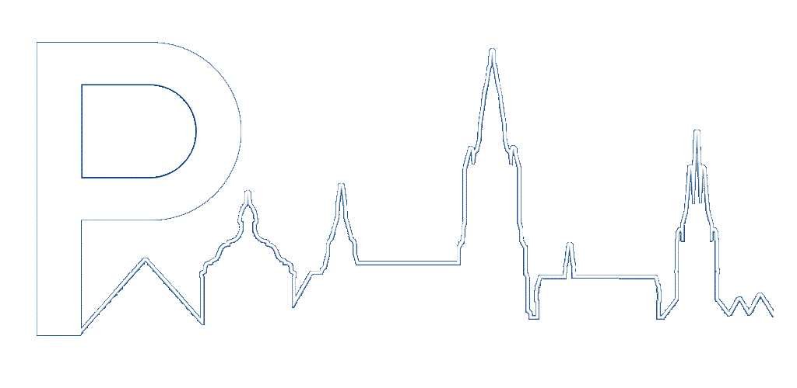

<div align="center">
  
  <br><br>
</div>

[](https://github.com/bircni/ParkenUlm/stargazers)
[](https://github.com/bircni/ParkenUlm/issues)
[](https://github.com/bircni/ParkenUlm/actions/workflows/gradle.yml)
[]( https://github.com/bircni/ParkenUlm/releases)
# ParkenUlm

<div align="center">
<a href='https://play.google.com/store/apps/details?id=development.parkenulm'></a>
<a href='https://apt.izzysoft.de/fdroid/index/apk/development.parkenulm'></a>
<a href='https://github.com/bircni/ParkenUlm/releases/latest'></a>
</div>

## About The Project

 A small Android App to see the current usage of the parking garages in Ulm, Germany.  
 The data is provided by the city of Ulm.  

- supports dark mode
- uses Internet connection only to fetch data
- supports Android N (API level 25) and higher
- Languages: German, English

## Screenshots

<div align="center">


</div>
</br>
<details>
<summary>Bright Mode</summary>
</br>
<div align="center">


</div>
</details>

## Prerequisites

- Android Studio
- Android SDK
- Android N (API 24) or higher

## Installation

Feel free to download the latest release from one of the sources above.  
If you want to build it yourself, follow the steps below.

1. Clone the repo

   ```sh
   git clone https://github.com/bircni/ParkenUlm.git
   ```

2. Open in Android Studio
3. Run on emulator or device

## Contributing

If you want to contribute - open an issue or a pull request.

1. Fork the Project
2. Use understandble commit messages
3. Open a Pull Request

## License

Distributed under the GNU General Public License v3.0. See `LICENSE` for more information.

## Thanks to

- [Parken in Ulm](https://www.parken-in-ulm.de/) for the data
- [@dj82atwork](https://github.com/dj82atwork) for the icon and testing
- [@IzzySoft](https://github.com/IzzySoft) for deploying the app on IzzyOnDroid
